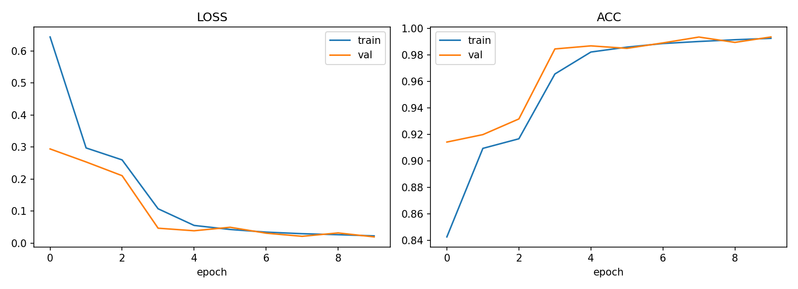

# Plant Disease Classifier — Transfer Learning + Explainable AI

A computer vision project that classifies crop leaf images as healthy or diseased across
**38 classes** using transfer learning, then explains *why* the model made each prediction
using Grad-CAM. Includes a Gradio demo for interactive testing.

## Why this project

Crop diseases are a major driver of yield loss worldwide, and manual diagnosis by farmers
or agronomists is slow and expertise-dependent. This project builds a lightweight, accurate
classifier that could plausibly run on a phone in the field, and pairs it with visual
explanations (Grad-CAM heatmaps) so predictions aren't a black box — important for anything
that influences a real agricultural decision.

It's also a deliberately compact demonstration of a full applied-DL workflow:
transfer learning → two-phase fine-tuning → quantitative evaluation → model
interpretability → a usable demo. That end-to-end shape is what most DL job/interview
screens actually probe for, more than raw accuracy.

## Dataset

[New Plant Diseases Dataset (Augmented)](https://www.kaggle.com/datasets/vipoooool/new-plant-diseases-dataset)
on Kaggle (originally derived from PlantVillage):

- ~87,900 RGB leaf images, 256×256, across **38 classes** (14 crop species × healthy/disease states)
- Pre-split: `train/` (70,295 images), `valid/` (17,572 images), `test/` (33 unlabeled images)
- Directory layout is already `ImageFolder`-compatible (one subfolder per class)

Not included in this repo (too large for git). See [`data/README.md`](data/README.md) for
download instructions.

## Approach

1. **Backbone**: ResNet18 pretrained on ImageNet (swap `--model` for `resnet50` / `efficientnet_b0` / `mobilenet_v2`)
2. **Phase 1 — head training**: freeze the backbone, train only the new classification head (fast, stabilizes the new layer)
3. **Phase 2 — fine-tuning**: unfreeze the whole network, train end-to-end at a lower learning rate
4. **Augmentation**: random resized crop, horizontal flip, rotation, color jitter — needed because the source images are fairly uniform (lab-style backgrounds), so augmentation reduces overfitting to background artifacts
5. **Evaluation**: accuracy, macro/weighted F1, per-class report, confusion matrix
6. **Explainability**: Grad-CAM heatmaps over the last conv block, to sanity-check the model is actually looking at lesions/discoloration and not background
7. **Demo**: Gradio app — upload a leaf photo, get the predicted class, confidence, and a Grad-CAM overlay

## Repo structure

```
plant-disease-classifier/
├── README.md
├── requirements.txt
├── data/
│   └── README.md          # dataset download instructions
├── src/
│   ├── dataset.py          # ImageFolder loaders + transforms
│   ├── model.py             # transfer-learning model builder
│   ├── train.py              # two-phase training loop
│   ├── evaluate.py           # metrics, confusion matrix, report
│   ├── gradcam.py            # Grad-CAM implementation
│   └── utils.py               # seeding, checkpoints, class-name I/O
├── app/
│   └── demo.py               # Gradio inference app
├── notebooks/
│   └── colab_train.ipynb    # one-click Colab training notebook (GPU)
└── results/                   # training curves, confusion matrix, checkpoints (gitignored)
```

## Setup

```bash
git clone <your-repo-url>
cd plant-disease-classifier
pip install -r requirements.txt
```

Download the dataset (see `data/README.md`), so you end up with:
```
data/
├── train/<38 class folders>/
└── valid/<38 class folders>/
```

## Usage

**Train** (two-phase transfer learning):
```bash
python src/train.py --data-dir data --model resnet18 --freeze-epochs 3 --finetune-epochs 7 --batch-size 32
```

**Evaluate** on the validation set:
```bash
python src/evaluate.py --data-dir data --checkpoint results/best_model.pt
```

**Run the interactive demo**:
```bash
python app/demo.py --checkpoint results/best_model.pt
```

## 📊 Results

| Metric | Value |
|---------|-------|
| Validation Accuracy | **99.35%** |
| Macro Precision | **99.3%** |
| Macro Recall | **99.3%** |
| Macro F1 Score | **99.3%** |
| Number of Classes | **38** |
| Validation Images | **17,572** |
| Backbone | **ResNet18 (Transfer Learning)** |
| Hardware | **Google Colab Tesla T4 GPU** |

## 📈 Training Curves

<p align="center">
  
</p>

## Tech stack

Python · PyTorch · torchvision · scikit-learn · Grad-CAM (custom hook-based implementation) · Gradio · Matplotlib/Seaborn

## Key files (for interview walkthroughs)

- **`src/model.py`** — the transfer-learning strategy: which layers get frozen/unfrozen and why, and how the classifier head is swapped in for a different `num_classes`.
- **`src/train.py`** — the two-phase schedule (frozen head → full fine-tune) plus early stopping; a good place to talk about how you'd defend hyperparameter choices.
- **`src/gradcam.py`** — the explainability piece; useful to discuss *why* interpretability matters when a model's output could inform a real agricultural/financial decision.

## Possible extensions

- Compare ResNet18 vs EfficientNet-B0 vs MobileNetV2 on accuracy/latency/size trade-offs
- Mixed-precision training (`torch.cuda.amp`) for faster iteration
- Export to ONNX / TorchScript + quantization for on-device (mobile) inference
- Handle class imbalance explicitly (weighted loss / oversampling) if you swap in a messier real-world dataset

## Acknowledgements

This project was developed by applying concepts learned from the **Deep Learning and Neural Networks** course by **upGrad**, along with the official **PyTorch** and **torchvision** documentation.

The project incorporates concepts including:
- Convolutional Neural Networks (CNNs)
- Transfer Learning
- Model Fine-tuning
- Image Classification
- Explainable AI (Grad-CAM)
- Model Evaluation using Accuracy, F1-score, and Confusion Matrix

The **PlantVillage** dataset was used for training and evaluating the model.
